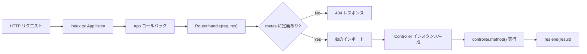

# TS-NodeJS-MVC-Framework
Node.jsを動作環境としたTypescriptで動くMVCモデルのフレームワークです。

## Application Core



- **index.ts**

  - アプリケーション全体のエントリーポイント
  - フレームワークの中核クラスAooを読み込み、HTTPサーバーを立ち上げる

  ```ts
    import { App } from './core/App';

    const app = new App();
    app.listen(3000);

  ```

  1. Appクラスをインポート
  2. new App()でアプリケーションインスタンスを生成
  3. app.listen(3000)を呼び出し、ポート3000番でHTTPサーバーを起動

- **src/core/App.ts**

  - ルーティングの定義場所
  - HTTPサーバー生成 -> リクエストをRouterに渡すハブ（仲介）

  ```ts
    constructor() {
      // ここでルート設定をまとめて行う
      this.router.get('/', 'HomeController@index');
    }
  ```

  ```ts
    const server = http.createServer((req, res) => {
      // リクエストが来たらRouterへバトンタッチ
      this.router.handle(req, res);
      ...
  ```
  1. constructor：new Routerの生成とGETリクエストのルートと対応コントローラーの登録
  2. listen(port)：Node.jsの組み込みとサーバーの生成、受け取ったreq,resをrouter.handleに渡す。

- **src/core/Router.ts**

  - dynamic routingに対応するための変換

  ```ts
    const regexPath = path.replace(/:([^\/]+)/g, (_, key) => {
      paramNames.push(key);            // 例: 'id'
      return '([^/]+)';                // 正規表現にする
    });
  ```

  - paramNamesにパラメータを保持しておく

  ```ts
    route.paramNames.forEach((name, index) => {
      params[name] = match[index + 1];
    });
  ```

  - Controllerの実行

  ```ts
    const [controllerName, methodName] = route.controller.split('@');
    const ControllerModule = await import(`../controllers/${controllerName}`);
    const controller = new ControllerModule.default();

    const result = await controller[methodName](params); // ← params渡す
  ```
